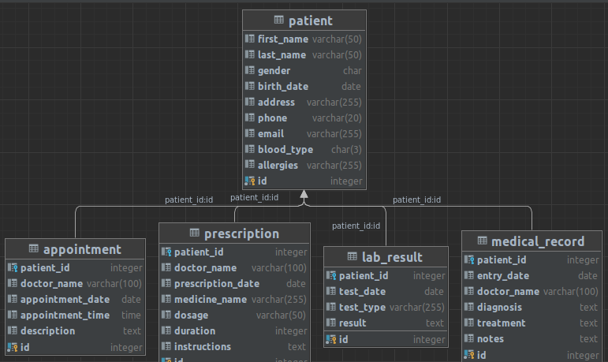

# Hospital Struktures

# Patient 
```sql


CREATE TABLE patient (
    id SERIAL PRIMARY KEY,
    first_name VARCHAR(50),
    last_name VARCHAR(50),
    gender CHAR(1),
    birth_date DATE,
    address VARCHAR(255),
    phone VARCHAR(20),
    email VARCHAR(255),
    blood_type CHAR(3),
    allergies VARCHAR(255)
);
```

# Appointment 
```sql
CREATE TABLE appointment (
    id SERIAL PRIMARY KEY,
    patient_id INTEGER REFERENCES patient(id),
    doctor_name VARCHAR(100),
    appointment_date DATE,
    appointment_time TIME,
    description TEXT
);
```

# Prescription 
```sql
CREATE TABLE prescription (
    id SERIAL PRIMARY KEY,
    patient_id INTEGER REFERENCES patient(id),
    doctor_name VARCHAR(100),
    prescription_date DATE,
    medicine_name VARCHAR(255),
    dosage VARCHAR(50),
    duration INTEGER,
    instructions TEXT
);
```

# Lab Result
```sql
CREATE TABLE lab_result (
    id SERIAL PRIMARY KEY,
    patient_id INTEGER REFERENCES patient(id),
    test_date DATE,
    test_type VARCHAR(255),
    result TEXT
);
```

# Medical Record
```sql
CREATE TABLE medical_record (
    id SERIAL PRIMARY KEY,
    patient_id INTEGER REFERENCES patient(id),
    entry_date DATE,
    doctor_name VARCHAR(100),
    diagnosis TEXT,
    treatment TEXT,
    notes TEXT
);
```

# Result

